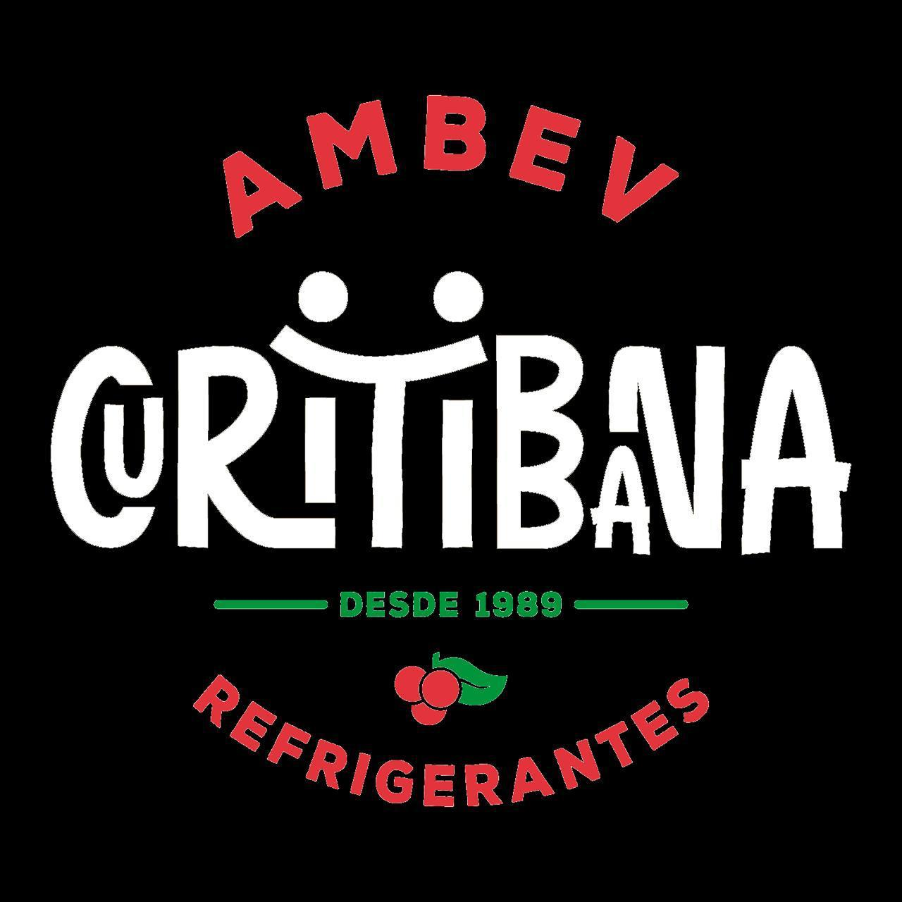

<h4 align="center">
  <br>
 <b>Facilitando as rotinas operacionais.</b> 🔧
</h4>

<br>

### 💻 Projeto

<b>Book CIL</b> 

### ⚙ Como rodar este projeto

O projeto está integrado backend e frontend:

1. Backend/Frontend

### Pré-requisitos

Antes de começar, você vai precisar ter instalado em sua máquina as seguintes ferramentas:

<b>[Git](https://git-scm.com)</b>

<b>[Node.js](https://nodejs.org/en/)</b>

E também será preciso um editor, eu indico o <b>[VSCode](https://code.visualstudio.com/)</b>

### 🧭 Rodando o Projeto

```bash
# Clone este repositório
$ git clone https://github.com/lucasmessias9898/bookCil.git

# Acesse a pasta do projeto no terminal/cmd
$ cd bookCil

# Instale as dependências
$ npm install 

# Execute a aplicação 
$ npm start

# A aplicação iniciará automaticamente. 
```

### ⚠️ Atenção

<b>O Projeto ainda está em desenvolvimento, o mesmo contará com atualizações e correções de possíveis erros.</b>

Feito com ❤️ by **Automação Curitibana e Lucas Messias** 🤙